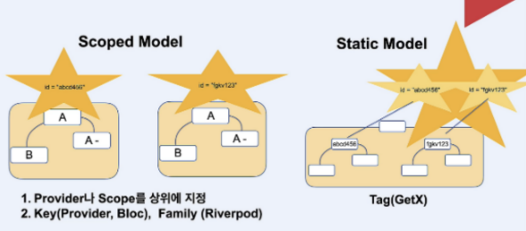

### State란?

- UI에 변화가 생기도록 영향을 미치는 데이터
- 애플리케이션 내부의 데이터나 정보
  - 사용자 인터페이스(UI)의 상태일 수도 있고, 애플리케이션의 동작을 제어하는 데 필요한 다양한 데이터나 정보
- 예)
  - To-do 앱
    - 사용자가 추가한 할 일 목록이나 각 할 일 항목의 완료 여부

플러터에서 UI를 구성하는 단위는 위젯이다.  
위젯은 build() 메서드를 통해 UI를 생성한다.  
이 메서드는 상태를 UI로 변환한다.

```plaintext
UI = f(state)
```

### State management 정의

1. 위젯이 쉽게 데이터에 접근할 수 있는 방법
2. 변화된 데이터에 맞추어서 UI를 다시 그려주는 기능

### 그렇다면 Flutter에서 State Management를 해야하는 이유는?

> 필요한 데이터를 쉽게 접근하기 위해서

---

### State Management의 종류

- **Provider**
- **Riverpod**
- setState
- ValueNotifier & InheritedNotifier
- InheritedWidget & InheritedModel
- June
- Redux
- Fish-Redux
- **BLoC** / Rx
- GetIt
- MobX
- Flutter Commands
- Binder
- **GetX**
- states_rebuilder
- Triple Pattern
- solidart
- flutter_reactive_value

> Flutter에는 State Management를 할 수 있는 방법이 여러가지가 있다. 다음 글에서는 사람들이 많이 사용하고 있고 기업에서도 많이 사용하고 있는 **Provider, GetX, Riverpod, BLoC**에 대해 자세하게 알아보겠다.
